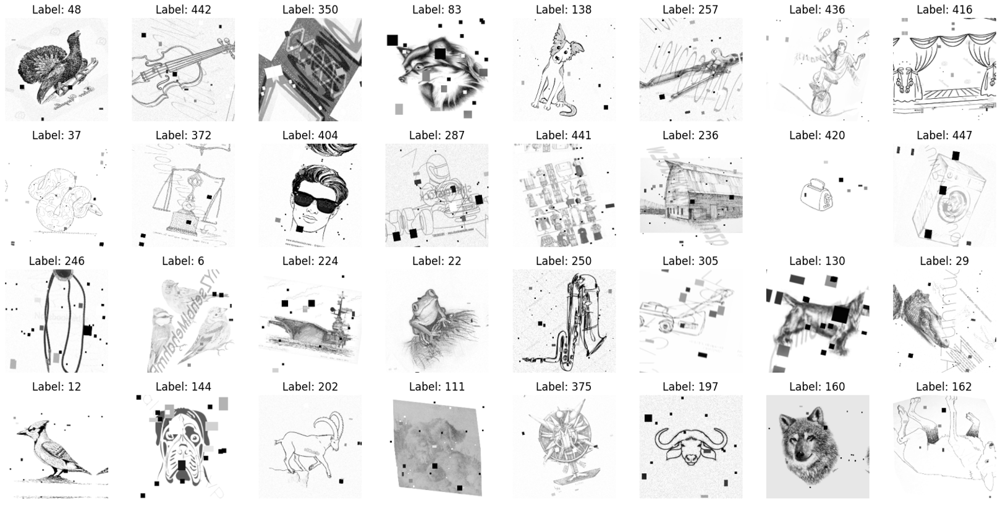
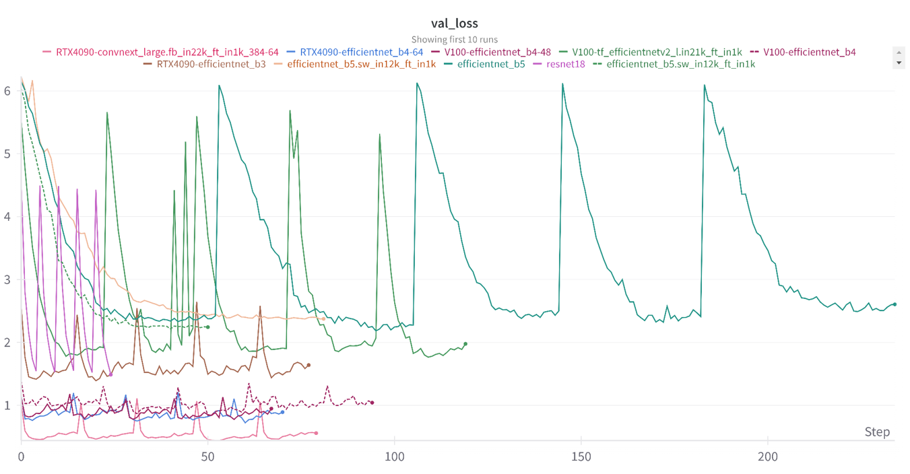

# Sketch 이미지 분류 프로젝트

본 프로젝트는 500개의 스케치(Sketch) 이미지 클래스를 딥러닝 모델을 통해 분류하는 프로젝트입니다. 흑백 및 컬러 스케치 이미지 데이터를 대상으로 최신 딥러닝 모델(**ResNet**, **ConvNeXt**, **EfficientNet** 등)을 사용하여 이미지에 그려진 객체를 정확히 예측하는 것을 목표로 합니다. 이를 위해 다양한 **데이터 전처리**, **이미지 증강 기법**, **하이퍼파라미터 튜닝**, 그리고 **모델 앙상블**을 활용하여 높은 정확도를 달성했습니다.

## 데이터셋

데이터셋은 총 500개의 클래스(학습 이미지 15,021장, 테스트 이미지 10,014장)로 구성됩니다. 


## 프로젝트 구조

```
SketchClassification/
├── main.py
└── packages
    ├── CustomDataset.py
    ├── Loss.py
    ├── Model.py
    ├── Trainer.py
    ├── Transform.py
    ├── Transform2.py
    └── __init__.py
```

각 파일은 데이터 전처리, 증강, 모델 정의, 학습 및 평가를 수행하도록 모듈화되었습니다.

---

## 사용한 모델 및 기법 설명

본 프로젝트에서는 다양한 CNN 계열의 모델을 실험하였으며, 최종적으로 높은 성능을 기록한 모델들을 중심으로 앙상블 기법을 적용했습니다.

- **ResNet (50, 101, 152)**: 베이스라인으로서 기초 성능 확인
- **EfficientNet (B0, B3, B4, V2)**: 적은 파라미터로 높은 성능을 목표
- **ConvNeXt (Base, Large, Huge)**: 최신 CNN 모델로 최고 성능 기록


### 이미지 증강(Data Augmentation)

모델의 크기가 커질수록 쉬운 이미지에 대해 과적합이 발생하는 것을 관찰하고, 이를 해결하기 위해 다양한 증강 기법을 적용하여 일반화 성능을 높였습니다.
- 회전, 확대/축소, 이동
- 가우시안 노이즈, 모션 블러
- 부분 삭제(Coarse Dropout)
- 명암, 대비 조정
- 워터마크 추가(과적합 방지)

### 하이퍼파라미터 튜닝 및 앙상블

최적의 하이퍼파라미터를 찾기 위해 다양한 실험을 진행했으며, 성능이 우수한 여러 모델들을 소프트 보팅 앙상블(Soft Voting Ensemble)로 최종 예측을 진행했습니다.

---

## 결과 이미지 예시

### 데이터 증강 예시


### Validation loss 추이



---

## 성능 비교 표

| 모델                     | 검증 정확도 (Top-1) |
|-------------------------|-------------------|
| ResNet-50               | 69.30%            |
| ResNet-101              | 82.90%            |
| ResNet-152              | 84.21%            |
| EfficientNet-B0         | 71.20%            |
| EfficientNet-B3         | 82.40%            |
| EfficientNet-B4         | 85.23%            |
| EfficientNetV2 (rw_m)   | 82.60%            |
| EfficientNetV2 (rw_t)   | 80.20%            |
| Inception v3            | 82.34%            |
| ConvNeXt v2 Base        | 88.10%            |
| ConvNeXt v2 Large       | 91.60%            |
| **ConvNeXt v2 Huge**    | **92.60%**        |


## 향후 개선점 및 TODO

향후 프로젝트에서는 다음과 같은 개선 방향을 고려 중입니다.

- Git을 활용한 협업 체계화
- 더 정교한 앙상블 기법 적용(Stacking, Blending 등)
- 자동화된 하이퍼파라미터 튜닝 및 실험 관리
- 코드의 모듈화 및 객체 지향적 구조화
- 추가 데이터 확보 및 멀티모달 확장

위 개선 사항을 통해 더욱 성능 높고 견고한 이미지 분류 모델을 개발하고자 합니다.

